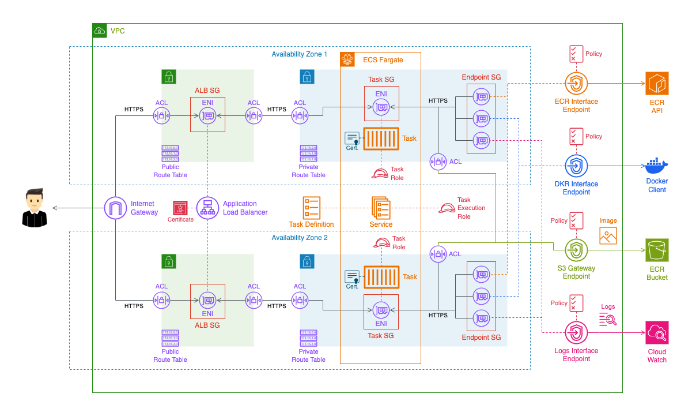

# Implementation of a Zero Trust architecture for Elastic Container Service (ECS)

This repository provides infrastructure as code to deploy containers securely on AWS using a Zero Trust architecture. Zero Trust is a network security philosophy based on the premise of not trusting any element of the network, both external and internal. Inspired by this approach, not only for the network but for all elements of the infrastructure, this repository provides infrastructure as code to deploy the architecture shown in the following diagram.



## Prerequisites

In addition to the resources deployed by the CloudFormation templates included in this repository, some elements of the infrastructure must be created beforehand, and references to these elements must be passed as parameters to these templates.

- **CloudWatch Logs Group**: Ensure you have created a log group in CloudWatch. This group will be used to store logs generated by the deployed services. Provide the Amazon Resource Name (ARN) of the CloudWatch Logs Group as a parameter when executing the templates.
- **Private Repository with a Docker Image**: Make sure you have created a private container registry in Elastic Container Registry (ECR). Ensure that this repository contains the Docker image required by the containers. Provide the URI of the Docker image in ECR as a parameter when executing the templates.
- **Certificate**: Ensure you have created a certificate in AWS Certificate Manager (ACM) to secure connections between users and the Application Load Balancer (ALB). Provide the ARN (Amazon Resource Name) of this certificate as a parameter when deploying related resources.

## Docker Image

Inside the Application folder, you will find the necessary resources to generate a Docker image with the application used in this example. It is a web server created with Bun that returns a Hello World! Additionally, a Dockerfile is included that defines how to build the Docker image, a self-signed certificate, and its private key. To generate the image and upload it to the ECR repository, which you should have previously created, you can use the following commands, replacing the necessary parameters with your data.

```shell
# Build the Docker image from the current context
docker build -t webserver .
# Tag the local image with the AWS ECR repository address
docker tag webserver:latest ACCOUNT_ID.dkr.ecr.REGION.amazonaws.com/REPO_NAME:latest
# Get the AWS ECR access token to authenticate with the repository
aws ecr get-login-password --region REGION | docker login --username AWS --password-stdin ACCOUNT_ID.dkr.ecr.REGION.amazonaws.com
# Push the tagged image to the AWS ECR repository
docker push ACCOUNT_ID.dkr.ecr.REGION.amazonaws.com/REPO_NAME:latest
```

## CloudFormation Deployment

The master.yaml file is designed to deploy the entire environment using a single template. When deploying it, you should pass as a parameter the S3 location within your AWS account and region where each of the dependent templates is located, and you can find them in this repository inside the Infrastructure folder. Upload all these templates to S3 and use their URLs as parameters when deploying master.yaml.

> [!CAUTION]
> Although the template is adapted to work in any AWS region, there is a specific parameter for the Ireland region. If you are deploying in another region, you will need to modify the parameter in master.yaml that is passed to the security.yaml template with a prefix list. You should find the corresponding Prefix List ID for the S3 service in your specific region and replace it.

> [!CAUTION]
> As it is not possible to set NetworkACL Prefix Lists as sources or destinations for rules, these have been manually set with the address ranges corresponding to the Ireland region. If you are deploying in another region, you will need to modify the NetworkACL in the security.yaml template.